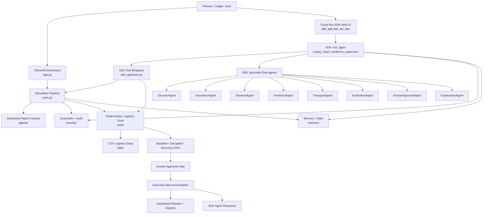
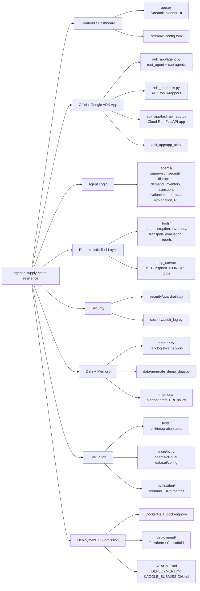
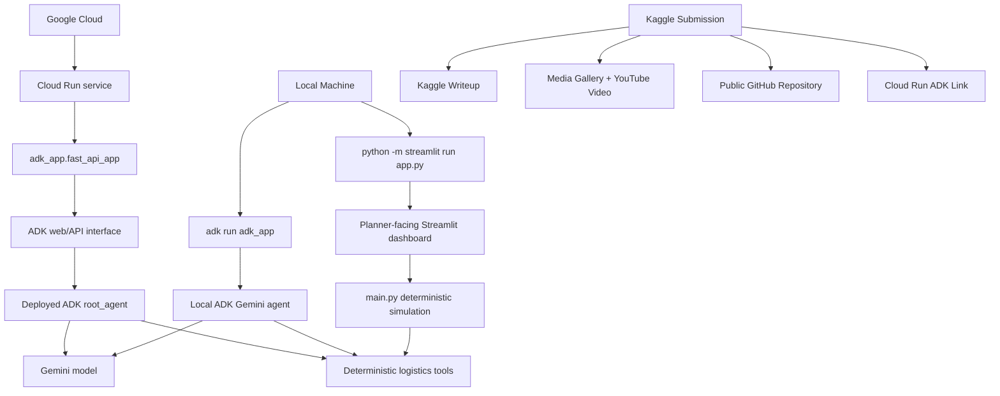
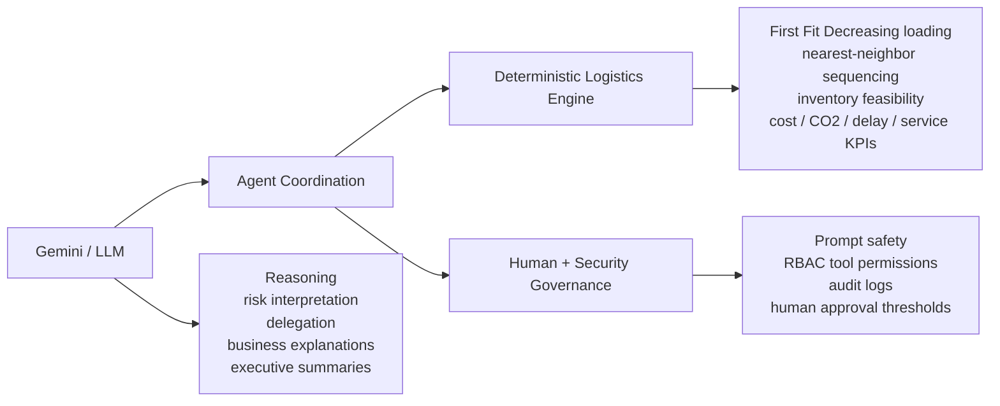

# Architecture Graph

This file gives a visual map of how the project is divided and how the main runtime paths work.

## 1. System Workflow

## 2. Repository Structure

## 3. Local vs Cloud Runtime

## 4. Responsibility Boundary

## 5. Competition Evidence Map

This architecture is designed to show that the project is more than a chatbot wrapper. Each layer provides evidence for a specific AI Agents Capstone requirement.

| Evidence | What It Demonstrates |
| --- | --- |
| Streamlit dashboard | A business-facing recovery planning interface with scenario selection, KPIs, tables, execution trace, chatbot popover, and an agent workflow graph. |
| ADK agent backend | Official Google ADK usage for defining the agent entrypoint, managing sessions, and exposing the deployed agent through the ADK runtime interface. |
| Multi-agent workflow | Specialized agents coordinate security, disruption analysis, demand impact, inventory feasibility, transport recovery, evaluation, approval, and final explanation. |
| Tool layer | Agents call deterministic logistics tools instead of asking the LLM to invent operational numbers. |
| Deterministic logistics engine | Truck loading, route sequencing, inventory feasibility, service level, cost, utilization, and CO2 calculations are handled by code. |
| Security and governance | The workflow includes request validation, tool permission checks, audit logging, and human approval thresholds. |
| Evaluation assets | Tests and evaluation files support repeatable validation instead of only relying on a live demo. |
| Cloud Run deployment | The ADK service is deployed to Google Cloud, making the backend accessible outside the local development environment. |

For a Kaggle submission, this diagram can be used in the writeup and video to explain how Gemini, ADK agents, local tools, deterministic logistics logic, and the Streamlit interface work together.
